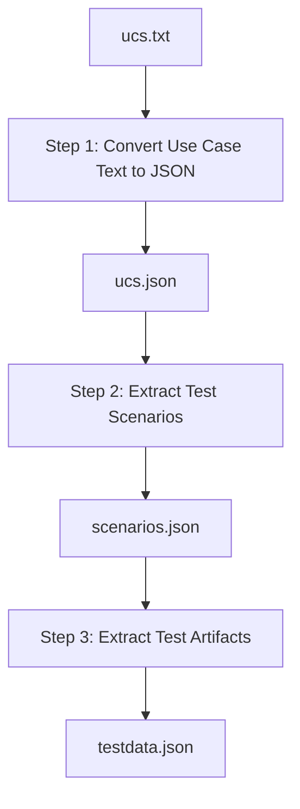

# FUNEETIS

FUNEETIS is a framework for generating end-to-end functional tests for IoT systems from structured use case specifications and system descriptions.

The repository is organized around two main modules:

1. **TestDataGen**  
   Generates test data from use case specifications and related input files.

2. **TestGen**  
   Generates executable test cases using the system description and the test data produced by TestDataGen.

---

## Repository Structure

```text
FUNEETIS/
├── TestDataGen/
├── TestGen/
├── Authoring_Guidelines.pdf
├── WIMP_System_Description.pdf
├── EWS-FD_Description.pdf
├── RUCM.xlsx
├── sut.json
├── testdata_rucm1.json
├── testdata_rucm2.json
├── testdata_rucm3.json
├── prompt.txt
└── README.md


## FUNEETIS Steps

FUNEETIS consists of six main steps that transform structured use case specifications into executable end-to-end IoT test cases.
| Step   | Description                                | Supported by |
| ------ | ------------------------------------------ | ------------ |
| Step 1 | Parse use case specifications              | TestDataGen  |
| Step 2 | Extract scenarios and relevant information | TestDataGen  |
| Step 3 | Generate test data                         | TestDataGen  |
| Step 4 | Manual refinement / preparation            | Manual       |
| Step 5 | Generate executable test cases             | TestGen      |
| Step 6 | Manual execution setup / validation        | Manual       |


## TestDataGen

`TestDataGen` is the first main module of FUNEETIS. It is responsible for transforming a structured use case specification into test data that can later be used by `TestGen` to generate executable tests.

`TestDataGen` covers **Step 1, Step 2, and Step 3** of the FUNEETIS workflow.

### Overview



### Step 1: Use Case Text to JSON

Step 1 takes the structured use case specification written in a text file and converts it into a JSON representation.

**Input**

```text
ucs.txt
```

**Output**

```text
ucs.json
```

The generated `ucs.json` file contains the parsed use case information in a structured format that can be processed automatically by the next steps.

### Step 2: Scenario Extraction

Step 2 takes the JSON file produced by Step 1 and extracts the test scenarios.

**Input**

```text
ucs.json
```

**Output**

```text
scenarios.json
```

This step extracts scenarios from the main flows of the use case, including:

- basic flow
- bounded flows
- specific flows

Each extracted scenario contains the relevant steps and postconditions needed for test-data generation.

### Step 3: Test Data Extraction

Step 3 takes each extracted scenario and produces the final test data.

**Input**

```text
scenarios.json
```

**Output**

```text
testdata.json
```

For each scenario, this step extracts:

- preconditions
- postconditions
- steps
- expected outputs
- payload-related information

The resulting `testdata.json` file is the main output of `TestDataGen`. It is later used by `TestGen`, together with `sut.json`, to generate executable test cases.

### Main Output

The main output of `TestDataGen` is:

```text
testdata.json
```

This file contains the generated test data organized by scenario.

### Summary

| Step | Input | Output | Description |
|------|-------|--------|-------------|
| Step 1 | `ucs.txt` | `ucs.json` | Converts the use case specification into JSON |
| Step 2 | `ucs.json` | `scenarios.json` | Extracts test scenarios |
| Step 3 | `scenarios.json` | `testdata.json` | Extracts test artifacts and generates test data |
